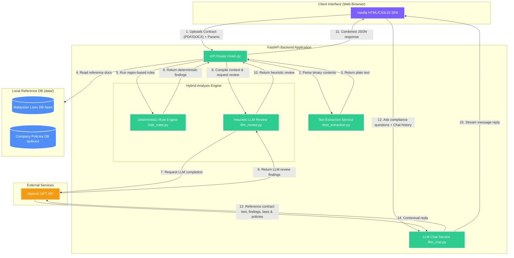

# 🔍 ContractSense — AI-Powered Contract Compliance Scanner
> **Pitch Deck & Project Documentation**  
> *Empowering Malaysian SMEs, HR professionals, and Legal teams to screen, flag, and remediate contract compliance risks in under 30 seconds.*
---
## 📋 Table of Contents
1. [Executive Summary](#-executive-summary)
2. [The Problem](#-the-problem)
3. [The Solution (ContractSense)](#-the-solution-contractsense)
4. [Target Market & User Personas](#-target-market--user-personas)
5. [Technical Architecture](#-technical-architecture)
6. [Business & Monetization Model](#-business--monetization-model)
7. [Go-To-Market (GTM) Strategy](#-go-to-market-gtm-strategy)
8. [Competitive Advantage](#-competitive-advantage)
9. [Future Roadmap](#-future-roadmap)
10. [Local Development Setup](#-local-development-setup)
---
## 🚀 Executive Summary
ContractSense is a hybrid **deterministic rule engine** and **LLM-powered compliance screening assistant** tailored specifically for the Malaysian business ecosystem. By cross-checking contracts against Malaysian laws (such as the *Employment Act 1955*, *PDPA 2010*, and *Companies Act 2016*) and uploaded company compliance guidelines, ContractSense helps organizations detect risky, unfair, or illegal clauses before signing, providing instant inline remediation recommendations.
---
## 📌 The Problem
In Malaysia's competitive business landscape, reviewing contracts presents substantial challenges for small-to-medium enterprises (SMEs) and corporate departments:
```
┌─────────────────────────────────────────────────────────────────────────┐
│                          THE COMPLIANCE TRAP                            │
├────────────────────────────┬────────────────────────────┬───────────────┤
│    Astronomical Costs      │     Regulatory Risk        │ Human Errors  │
│  RM 500 - RM 2,500 per     │ Recent Employment Act      │ Manual review │
│  review makes legal fees   │ amendments (2022) & PDPA   │ of 30+ pages  │
│  unaffordable for SMEs.    │ updates carry heavy fines. │ misses hidden │
│                            │                            │ auto-renewals.│
└────────────────────────────┴────────────────────────────┴───────────────┘
```
1. **High Legal Fees**: Hiring a lawyer to perform initial screenings is cost-prohibitive for the **97% of Malaysian businesses** classified as SMEs.
2. **Evolving Regulatory Framework**: Amendments like the *Employment Act (Amended 2022)* (e.g., changes to overtime, working hours, maternity/paternity leave) make keeping contracts up-to-date highly complex.
3. **Internal Policy Drift**: Teams frequently sign vendor agreements, non-disclosure agreements (NDAs), and leases that conflict with internal corporate governance policies because they lack an easy way to verify them in bulk.
4. **The Turnaround Bottleneck**: Relying on external counsel leads to review delays of **3 to 7 days**, causing lost sales deals and slower hiring cycles.
---
## 💡 The Solution (ContractSense)
ContractSense automates the contract review pipeline by combining **regex-based pattern recognition** with **generative AI contextual checking**.
*   **Dual-Layer Audit**: Flag deterministic issues (like hidden fee keywords, silent auto-renewals, or extreme liability caps) instantly, while utilizing LLMs to catch semantic loopholes, jurisdictional mismatches, and conflicts with uploaded reference materials.
*   **Malaysian Legal Base**: Built-in verification triggers for the *Employment Act 1955*, *Personal Data Protection Act (PDPA) 2010*, and *Companies Act 2016*.
*   **Custom Corporate Policy Matching**: Users can drag and drop internal employee handbooks or company compliance policies to run bespoke verification rules.
*   **Interactive Remediation**: Generates side-by-side contract-to-issue highlighting and copy-pasteable redline corrections.
*   **Bespoke AI Legal Chat**: A context-aware chatbot that uses the scanned contract, rule violations, and reference databases as ground truth, preventing general AI hallucinations.
---
## 🎯 Target Market & User Personas
ContractSense addresses three primary user groups:
### 1. The HR Manager (compliance-focused)
*   **Pain Point**: Generating dozens of employment offers annually, needing to ensure terms match the *Employment Act 1955* guidelines on leave, working hours, and termination notices.
*   **Use Case**: Batch-scans employee agreements to verify regulatory compliance and check terms against internal HR manuals.
### 2. The SME Business Owner (cost-conscious)
*   **Pain Point**: Signing incoming supplier contracts, software licenses, or commercial leases without legal representation due to budget limitations.
*   **Use Case**: Drags and drops contracts to identify hidden fees, unilateral modification rights, or problematic auto-renewal clauses.
### 3. Corporate Legal & Operations Teams (efficiency-focused)
*   **Pain Point**: Flooded with minor reviews (such as NDAs or standard service agreements), leaving less time for high-value strategic work.
*   **Use Case**: Performs first-pass triage with ContractSense to quickly catch non-standard terms, reducing review turnaround times from hours to seconds.
---
## ⚙️ Technical Architecture
ContractSense uses a hybrid architecture that splits workloads between high-fidelity deterministic parsers and a flexible LLM reasoning layer.
### 🏗️ Technical Architecture Diagram
The diagram below outlines the end-to-end data flow when a user uploads a contract for analysis:

### 🛠️ Technical Stack Breakdown
*   **Frontend**: Single Page Application (SPA) designed using clean, high-performance Vanilla HTML5, CSS3, and ES6 JavaScript. Includes custom side-by-side document views and responsive page-state routing.
*   **Backend Framework**: FastAPI (Python) for asynchronous endpoints, low latency, and automatic Swagger/OpenAPI documentation generation.
*   **Text Processing**: `PyPDF2` and custom `docx` binary stream extractors running on the backend, processing payloads safely without writing documents to public folders.
*   **Rule Engine**: Native regex-based scoring engine evaluating seven distinct high-risk categories (Auto-Renewal, Unilateral changes, Hidden fees, Liability limitations, Data transfers, Exclusive remedies, and External URL terms).
*   **LLM Orchestrator**: Async OpenAI API integration, utilizing system prompt directives to inject context (extracted contract text, deterministic rule violations, and reference law databases) to produce targeted executive reviews.
---
## 📊 Business & Monetization Model
ContractSense utilizes a Software-as-a-Service (SaaS) subscription model with tiered packaging designed for different scale requirements:
|
 Tier 
|
 Target Audience 
|
 Pricing 
|
 Features Included 
|
|
:---
|
:---
|
:---
|
:---
|
|
**
Starter / Dev
**
|
 Startups & Solopreneurs 
|
**
Free
**
 (RM 0) 
|
 Up to 3 contract scans/month, standard Malaysian laws checks, community support. 
|
|
**
Professional
**
|
 SMEs & Growing HR Teams 
|
**
RM 149 / month
**
|
 Unlimited scans, custom company policy uploads, full inline suggestions, PDF export. 
|
|
**
Enterprise
**
|
 Large Scale / Legal Depts 
|
**
RM 499 / month
**
|
 Team workspaces, API keys, custom regulatory law reference files, dedicated customer success. 
|
---
## 🚀 Go-To-Market (GTM) Strategy
To accelerate product adoption in the Malaysian market, ContractSense leverages a targeted, multi-channel growth plan:
1.  **SME Association Partnerships**: Partner with organizations like SAMENTA (SME Association of Malaysia) and MDEC (Malaysia Digital Economy Corporation) to offer compliance screening masterclasses.
2.  **Product-Led Growth (PLG)**: Offer a free "Quick Scan" tool on the homepage, allowing users to upload short contracts without creating an account, driving sign-ups after value validation.
3.  **Content-driven SEO**: Focus on high-intent local search keywords, publishing guides on employment law amendments, tenancy dispute resolution, and corporate governance in Malaysia.
4.  **Template Library Integration**: Provide free, verified template contracts (employment contracts, NDAs) that link users directly to the scanner to check external modifications.
---
## ⚖️ Competitive Advantage
ContractSense holds key advantages over broad, generic LLM tools:
*   **Precision Focus**: General chatbots (like ChatGPT) analyze documents without legal references. ContractSense anchors its assessments in uploaded **Malaysian law databases** and **internal company guidelines**.
*   **Hybrid Engine Efficiency**: Combining local regex rules with API checks ensures that critical contract flaws (e.g. unilateral changes) are identified instantly, using LLMs primarily for nuance.
*   **Data Isolation**: Text extraction happens dynamically in memory. The system does not save contracts in public repositories or train models on user data, keeping enterprise contracts private.
---
## 🗺️ Future Roadmap
```
  ┌────────────────────────┐       ┌────────────────────────┐       ┌────────────────────────┐
  │        Q3 2026         │       │        Q4 2026         │       │        Q1 2027         │
  ├────────────────────────┤       ├────────────────────────┤       ├────────────────────────┤
  │ • Bahasa Melayu OCR    │──────>│ • DocuSign API         │──────>│ • Fine-tuned Legal LLM │
  │ • Tenancy Act Support  │       │   Integration          │       │   (Reduced API Costs)  │
  └────────────────────────┘       └────────────────────────┘       └────────────────────────┘
```
*   **Q3 2026: OCR Scanning & Bilingual Audits**  
    Introduce optical character recognition (OCR) for scanned PDFs and support bilingual analysis (English and Bahasa Melayu) to accommodate regional contracts.
*   **Q4 2026: E-Signature Integration**  
    Integrate e-signature providers (like DocuSign or HelloSign) to let users edit, check, and sign compliance-vetted documents in a single workflow.
*   **Q1 2027: Specialized Legal LLMs**  
    Transition to a fine-tuned, open-source legal model (such as Llama-3-Legal-Malaysian) hosted locally, reducing dependency on OpenAI API fees and increasing analysis speed.
---
## 💻 Local Development Setup
To run ContractSense on your local machine:
### Prerequisites
*   Python 3.10+
*   Node.js (optional, for hosting the frontend locally)
*   OpenAI API Key (optional, for full heuristic LLM analysis)
### 1. Start the Backend API
1. Open a terminal and navigate to the backend folder:
   ```powershell
   cd backend
   ```
2. Create and activate a Python virtual environment:
   ```powershell
   python -m venv .venv
   # Windows:
   .\.venv\Scripts\Activate.ps1
   # macOS/Linux:
   source .venv/bin/activate
   ```
3. Install the dependencies:
   ```bash
   pip install -r requirements.txt
   ```
4. Copy `.env.example` to `.env` and insert your `OPENAI_API_KEY`:
   ```bash
   # Adjust environment variables as needed
   ```
5. Run the FastAPI development server:
   ```bash
   uvicorn app.main:app --reload --host 127.0.0.1 --port 8000
   ```
### 2. Run the Frontend
1. Open the `/frontend` directory.
2. Double-click [index.html](file:///c:/Users/USER/OneDrive%20-%20Universiti%20Tunku%20Abdul%20Rahman/Documents/NexHack2026/frontend/index.html) to open the web app directly in your browser.
3. *Alternative (using a local dev server)*:
   ```powershell
   # In frontend folder:
   npx serve .
   ```
4. Upload a contract, select the laws you'd like to check it against, and start scanning!
